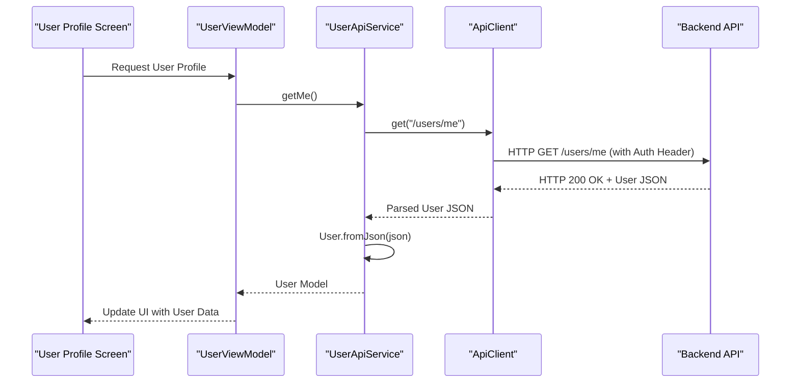

# API Service Layer Design Document

## 1. Overview

This document outlines the design for introducing a structured API service layer into the Flutter project. The primary goal is to enhance the application's architecture by separating concerns related to API communication, improving maintainability, testability, and overall code organization. This will involve creating dedicated service classes for different API tags (e.g., users, appointments), a central API client, and robust data models with JSON serialization.

## 2. Detailed Analysis of the Goal/Problem

### 2.1. Current State

Currently, API calls and data handling logic might be scattered across various parts of the application, potentially within UI components or utility files without a clear, consistent structure.

### 2.2. Problem Statement

The existing approach presents several challenges:

*   **Lack of Separation of Concerns:** UI components might directly handle network requests and JSON parsing, blurring the lines between presentation logic and data fetching.
*   **Poor Testability:** Direct API calls within widgets make it difficult to write isolated unit tests for UI components without performing actual network requests.
*   **Difficult Maintenance:** As the application grows, locating and modifying API-related logic becomes cumbersome, leading to increased development time and potential for errors.
*   **Code Duplication:** Similar API call patterns (e.g., adding authorization headers, error handling) might be repeated across different parts of the codebase.
*   **Inconsistent Error Handling:** Without a centralized mechanism, error handling can be inconsistent, leading to a poor user experience and difficult debugging.

### 2.3. Goal

The objective is to implement a robust, maintainable, and testable API service layer that adheres to best practices. This will involve:

*   **Centralized API Client:** A single client responsible for core network operations, common headers, and generic error handling.
*   **Feature-Specific API Services:** Dedicated service classes (e.g., `UserApiService`, `AppointmentsApiService`) that encapsulate all API calls related to a specific domain or "tag" as defined by the backend.
*   **Structured Data Models:** Utilizing `json_serializable` for efficient and error-free JSON parsing and serialization.
*   **Consistent Error Handling:** Implementing custom exceptions and centralized error management.
*   **Improved Testability:** Facilitating easy mocking of API services for unit and widget testing.

## 3. Alternatives Considered

*   **No Dedicated Service Layer:**
    *   **Pros:** Quick initial setup for very small projects.
    *   **Cons:** Leads to all the problems outlined in Section 2.2. Not scalable or maintainable for any real-world application.
*   **Single Monolithic API Service:**
    *   **Pros:** All API logic in one place.
    *   **Cons:** Becomes a "god object" that is difficult to manage, navigate, and test as the number of endpoints grows. Violates the Single Responsibility Principle.
*   **Using a Package like `Chopper` or `Retrofit`:**
    *   **Pros:** Automates much of the boilerplate for API definitions, type safety, and request/response handling.
    *   **Cons:** Adds another dependency and a learning curve. For this project, where the backend is already defined and the API surface is manageable, a manual approach with the `http` package and `json_serializable` offers sufficient control and flexibility without the overhead of a full code-generation framework for the API client itself. We will stick to `http` for the core client and `json_serializable` for models.

## 4. Detailed Design for the Modification

### 4.1. Core Principles

*   **Separation of Concerns:** Each component (UI, service, client, model) has a single, well-defined responsibility.
*   **Testability:** Components are designed to be easily mocked or faked for testing.
*   **Maintainability:** Code is organized logically, making it easy to understand, modify, and extend.
*   **Immutability:** Data models will be designed to be immutable where possible.
*   **Null Safety:** Full leverage of Dart's null safety features.

### 4.2. Project Structure

A new `data` directory will be introduced under `lib/src` to house the API service layer components.

```
lib/
├── src/
│   ├── config/
│   ├── data/
│   │   ├── models/             # JSON serializable data models
│   │   │   ├── user.dart
│   │   │   ├── user.g.dart     # Generated by build_runner
│   │   │   └── ...
│   │   ├── network/            # Base API client, custom exceptions
│   │   │   ├── api_client.dart
│   │   │   └── app_exceptions.dart
│   │   └── services/           # Feature-specific API services
│   │       ├── user_api_service.dart
│   │       ├── appointments_api_service.dart
│   │       └── ...
│   ├── screens/
│   ├── services/               # Other application services (e.g., local storage, business logic)
│   ├── utils/
│   └── widgets/
```

### 4.3. `ApiClient` (Base API Client)

This class will be the central point for all HTTP requests.

*   **Location:** `lib/src/data/network/api_client.dart`
*   **Dependencies:** `package:http/http.dart` (or `dio` if preferred, but `http` is simpler for this scope).
*   **Responsibilities:**
    *   Manages the base URL for the backend API.
    *   Adds common headers to all requests (e.g., `Content-Type: application/json`, `Authorization: Bearer <token>`).
    *   Handles token retrieval (e.g., from a secure storage service).
    *   Performs raw HTTP requests (`GET`, `POST`, `PUT`, `DELETE`).
    *   Implements generic response handling, including decoding JSON and throwing custom exceptions for API errors (e.g., 4xx, 5xx status codes).
*   **Methods:**
    *   `Future<dynamic> get(String path)`
    *   `Future<dynamic> post(String path, {Map<String, dynamic>? body})`
    *   `Future<dynamic> put(String path, {Map<String, dynamic>? body})`
    *   `Future<dynamic> delete(String path)`

### 4.4. Feature-Specific API Services

These classes will encapsulate the logic for interacting with specific API endpoints, grouped by their domain or "tag."

*   **Location:** `lib/src/data/services/` (e.g., `user_api_service.dart`, `appointments_api_service.dart`)
*   **Dependencies:** `ApiClient`, relevant data models.
*   **Responsibilities:**
    *   Define methods that correspond to specific API operations (e.g., `UserApiService.getMe()`, `AppointmentsApiService.createMeeting()`).
    *   Call the `ApiClient` to perform the actual HTTP request.
    *   Handle JSON deserialization of the `ApiClient`'s raw response into specific data models.
    *   Propagate specific custom exceptions from the `ApiClient` or throw new ones if business logic dictates.
*   **Example (`UserApiService`):**
    ```dart
    // lib/src/data/services/user_api_service.dart
    import 'package:softmed24h/src/data/network/api_client.dart';
    import 'package:softmed24h/src/data/models/user.dart'; // Assuming User model exists

    class UserApiService {
      final ApiClient _apiClient;

      UserApiService(this._apiClient);

      Future<User> getMe() async {
        final response = await _apiClient.get('/me'); // Path relative to /users prefix
        return User.fromJson(response);
      }

      Future<User> createUser(UserCreate user) async {
        final response = await _apiClient.post('/', body: user.toJson()); // Path relative to /users prefix
        return User.fromJson(response);
      }

      Future<void> updatePassword(String currentPassword, String newPassword) async {
        await _apiClient.put(
          '/me/password',
          body: {'current_password': currentPassword, 'new_password': newPassword},
        );
      }
    }
    ```

### 4.5. Data Models (`json_serializable`)

All data structures exchanged with the API will be represented by Dart classes using `json_annotation` and `json_serializable`.

*   **Location:** `lib/src/data/models/`
*   **Dependencies:** `package:json_annotation/json_annotation.dart`, `part 'model.g.dart';`
*   **Code Generation:** `build_runner` will be used to generate `*.g.dart` files.
*   **Naming Convention:** `fieldRename: FieldRename.snake` will be used in `@JsonSerializable` to automatically convert Dart's `camelCase` to backend's `snake_case` JSON keys.
*   **Example (`user.dart`):**
    ```dart
    // lib/src/data/models/user.dart
    import 'package:json_annotation/json_annotation.dart';

    part 'user.g.dart';

    @JsonSerializable(fieldRename: FieldRename.snake)
    class User {
      final int id;
      final String email;
      final String name;
      // ... other fields

      User({required this.id, required this.email, required this.name});

      factory User.fromJson(Map<String, dynamic> json) => _$UserFromJson(json);
      Map<String, dynamic> toJson() => _$UserToJson(this);
    }

    @JsonSerializable(fieldRename: FieldRename.snake)
    class UserCreate {
      final String email;
      final String password;
      final String name;
      // ... other fields

      UserCreate({required this.email, required this.password, required this.name});

      factory UserCreate.fromJson(Map<String, dynamic> json) => _$UserCreateFromJson(json);
      Map<String, dynamic> toJson() => _$UserCreateToJson(this);
    }
    ```

### 4.6. Error Handling

A consistent error handling strategy will be implemented.

*   **Custom Exceptions:**
    *   `lib/src/data/network/app_exceptions.dart` will define custom exception classes (e.g., `ApiException`, `NetworkException`, `UnauthorizedException`).
    *   `ApiException` will carry details like status code and server message.
*   **Centralized Handling in `ApiClient`:** The `ApiClient` will catch HTTP errors and map them to appropriate custom exceptions.
*   **Propagation:** Feature-specific services will catch these custom exceptions and either re-throw them or transform them into more domain-specific errors if necessary.
*   **UI Layer:** The UI will catch these exceptions and display user-friendly messages.

### 4.7. Dependency Injection

Manual constructor injection will be the primary method for managing dependencies.

*   The `ApiClient` will be instantiated once (e.g., at the root of the application or via a simple service locator).
*   Feature-specific API services will receive the `ApiClient` instance through their constructors.
*   Widgets or ViewModels will receive the necessary API services through their constructors or via a state management solution (e.g., `Provider` if already in use).

## 5. Diagrams

### 5.1. High-Level Architecture

```mermaid
graph TD
    A[UI Layer (Widgets/Screens)] --> B(Presentation Logic / ViewModels)
    B --> C(Feature API Services)
    C --> D(API Client)
    D -- HTTP Requests --> E[Backend REST API]
    E -- HTTP Responses --> D
    D --> C
    C --> B
    B --> A
```

### 5.2. Data Flow for a User Profile Request



## 6. Summary

This design proposes a clear, layered architecture for API communication in the Flutter project. By introducing a dedicated `ApiClient`, feature-specific API services, and `json_serializable` models, we will achieve better separation of concerns, improved testability, and enhanced maintainability. Consistent error handling and manual dependency injection will further contribute to a robust and scalable solution.

## 7. References

*   [Flutter API Service Layer Best Practices (from web search)](https://www.google.com/search?q=Flutter+API+service+layer+best+practices+dependency+injection+error+handling+JSON+serialization)
*   [Effective Dart: Usage](https://dart.dev/effective-dart/usage)
*   [JSON and serialization | Flutter](https://docs.flutter.dev/data/json/overview)
*   [Dependency injection | Flutter](https://docs.flutter.dev/data/dependency-injection)
